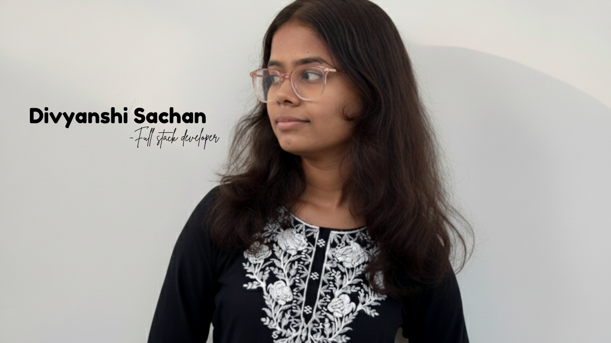

<!-- Banner / Greeting -->
<h1 align="center">Hey 👋, I'm Divyanshi Sachan</h1>
<h3 align="center">Aspiring AI/ML Engineer | Full Stack Developer | DSA Enthusiast | Tech Explorer 🚀</h3>

<!-- Profile Picture -->

  

---

## 👩‍💻 About Me
- 🎓 I’m pursuing **B.Tech in Computer Science and AI**  
- 🌱 Currently learning **AI/ML, Backend Development, and UI/UX**  
- 💡 I love solving **DSA problems** & building **creative apps**  
- 🎨 Apart from tech, I enjoy **poetry, mandala art, and exploring human behavior**  
- 🔭 I’m working on: **AI Content Generator SaaS & Journaling App**  

---

## 🛠 Tech Stack

### 🚀 Languages

### 🖼 Frontend

### ⚙️ Backend

### 🛢 Databases

### 🔧 Tools & Platforms

---

## 🔗 Let's Connect

  
  
  
  

---

## 📊 GitHub Stats

  
  

  

---

## 📈 Activity Graph

  

---

## 🌟 Interests
- 🧠 Artificial Intelligence & Machine Learning  
- 💻 Full Stack Web Development  
- 🎨 UI/UX Design & Creative Coding  
- 📚 Competitive Programming (DSA)  
- 🛠 Building SaaS apps & open-source projects  

---

## 🚀 Projects

| Project | Description | Tech Stack | Link |
|---------|-------------|------------|------|
| **Journaling App** | Digital journaling app with themes, AI writing, doodles, and community journal | Next.js, MongoDB, Drizzle, Prisma | [Repo](#) |
| **AI Content Generator** | SaaS app for repurposing blogs & videos into social media content | React, Node.js, OpenAI API | [Repo](#) |
| **Rideshare App** | Carpooling app with auth and ride-sharing features | React, Clerk | [Repo](#) |

---

## ✨ Fun Animation

  

---

⭐️ From [DivyanshiSachan](https://github.com/divyanshi-sachan)
